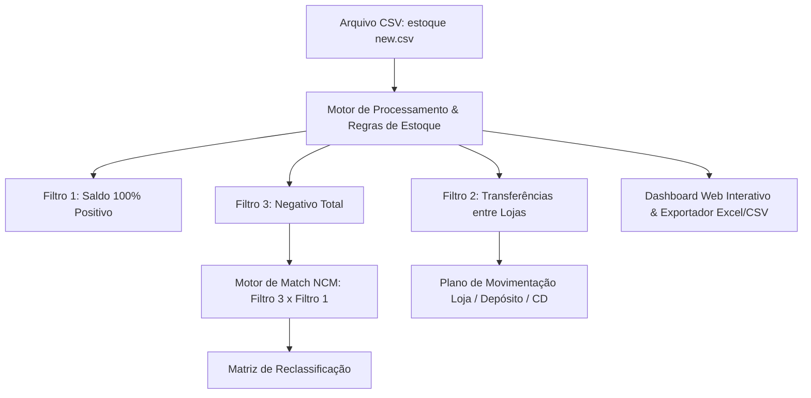

# Roadmap & Plano de Implementação: Análise, Transferência e Reclassificação de Estoque

Este plano estabelece o roadmap completo para processamento, categorização e automação da análise dos **35.264 produtos** e **43.512 registros** da base `estoque new.csv` (Lojas 1 - Loja, 2 - Depósito e 3 - CD).

---

## 📊 Diagnóstico Inicial da Base de Dados

Após o processamento inicial do arquivo `estoque new.csv`, identificamos a seguinte distribuição:

| Categoria | Descrição | Quantidade de Itens | Ação Recomendada |
| :--- | :--- | :--- | :--- |
| **Filtro 1 (100% Positivo)** | Itens com saldo $\ge 0$ em todas as lojas (sem nenhum negativo) | **29.926 itens** | Manter como **Saldo Seguro** e usar como doador para reclassificação. |
| **Filtro 2 (Misto / Transferível)** | Positivo em uma loja e negativo em outra(s) | **1.719 itens** | Gerar **Sugestões de Transferência Interna** (ex: CD $\rightarrow$ Loja) para zerar os negativos sem custo. |
| **Filtro 3 (Negativo Total)** | Saldo $\le 0$ em todas as lojas (sem saldo positivo para transferir) | **3.619 itens** | Requer **Compra** ou **Reclassificação Fiscal por NCM**. |
| **Reclassificação (Filtro 4)** | Itens do Filtro 3 que possuem correspondentes com saldo positivo no Filtro 1 (mesmo NCM) | **3.595 de 3.619 itens** (99,3%) | Match automático por NCM e valor de custo/descrição para abater o saldo. |

---

## 🗺️ Roadmap de Execução

### **Fase 1: Motor de Cálculo & Exportações Estruturadas (Imediato)**
* **Geração de arquivos CSV/Excel segmentados:**
  1. `1_saldo_positivo_puro.csv` (Itens sem problemas de saldo negativo).
  2. `2_plano_transferencias_internas.csv` (Tabela detalhada com: *Código, Descrição, Loja Origem, Loja Destino, Qtd a Transferir, Saldo Restante*).
  3. `3_itens_criticos_compra_reclassificacao.csv` (Itens sem saldo na rede).
  4. `4_sugestoes_reclassificacao_ncm.csv` (Cruzamento automático: Item Negativo $\leftrightarrow$ Item(ns) Doador(es) do mesmo NCM com saldo disponível).

### **Fase 2: Dashboard Web Operacional (Painel Visual e Interativo)**
* **Interface moderna (SPA Local):**
  * **Visão Geral:** Cards com totais de itens, volume financeiro de saldo negativo vs saldo positivo, índice de cobertura por NCM.
  * **Módulo de Transferências (Filtro 2):** Simulador visual onde o operador vê quanto cada loja precisa ceder ou receber para zerar os saldos negativos.
  * **Módulo de Reclassificação por NCM (Filtro 4):** Ao clicar em um item negativo, o painel lista os itens positivos do mesmo NCM, calculando a quantidade exata a compensar (1 para 1 ou por valor).
  * **Consulta em Tempo Real:** Botão integrado à API ERP para verificar se o saldo atual do produto já mudou no sistema.

### **Fase 3: Auditoria & Validação de Regras de Negócio**
* Validação de restrições fiscais (ex.: compatibilidade de NCM, alíquotas ou seções de produtos quando aplicável).
* Relatório consolidado para aprovação gerencial e contábil.

---

## 🔍 Regras de Compensação Propostas

1. **Regra de Transferência Interna (Filtro 2):**
   * Se Loja 1 tem saldo $-X$ e Loja 3 (CD) tem saldo $+Y$:
     * Quantidade a transferir: $\min(X, Y)$ da Loja 3 para Loja 1.
     * Prioridade de doação: CD (Loja 3) $\rightarrow$ Depósito (Loja 2) $\rightarrow$ Loja (Loja 1).
2. **Regra de Reclassificação por NCM (Filtro 4):**
   * Busca no Filtro 1 todos os produtos com exatamente o mesmo código NCM.
   * Ordena os doadores por:
     1. Similaridade na descrição do produto.
     2. Maior saldo disponível.
   * Simula a compensação do saldo até zerar a pendência do item negativo.

---

## 📋 Plano de Verificação

### Testes Automatizados & Validação de Dados:
* Garantir que a soma de todos os grupos seja exatamente igual aos 35.264 produtos da base.
* Verificar se nenhuma transferência gerada cria um saldo negativo na loja de origem.
* Conferir se todos os matches de reclassificação preservam 100% da igualdade de NCM.

### Verificação Manual:
* Abrir os relatórios gerados e validar itens de exemplo com os saldos do ERP.
* Testar a interface web interativa navegando pelos 4 filtros.

---

## 🏢 Fase Especial: Unificação e Movimentação entre Locais de Estoque

Esta fase operacional atende à consolidação física e fiscal dos múltiplos locais de estoque das lojas (Galpão, Galpão MIDI, CD MIDI) para os locais definitivos **GERAL** e **PADRÃO**, conforme orientação da diretoria:

### 1. Regras Operacionais de Direcionamento
* **Locais com "MIDI"** (`20 - GALPÃO MIDI`, `23 - CD MIDI`) ➡️ Transferir saldo para **`4 - GERAL`**.
* **Locais sem "MIDI"** (`15 - GALPÃO`) ➡️ Transferir saldo para **`1 - PADRÃO`**.
* **Locais Especiais** (`3 - GERENCIAL` e `21 - PRODUTOS QUEBRADOS`) 🛑 **Intocados / Deixar quieto**.

### 2. Painel Consolidado das Transferências de Locais

| Lote Operacional | Loja | Local Origem | Local Destino | Itens | Peças a Transferir | Custo Total (R$) | Valor de Venda (R$) |
| :--- | :--- | :--- | :---: | :---: | :---: | :---: | :---: |
| **Lote 1** | Loja 3 (CD) | `20 - GALPÃO MIDI` | **4 - GERAL** | **1.980** | 230.543 un | R$ 675.040,12 | R$ 5.060.915,66 |
| **Lote 2** | Loja 3 (CD) | `15 - GALPÃO` | **1 - PADRÃO** | **185** | 20.487 un | R$ 74.967,28 | R$ 350.512,54 |
| **Lote 3** | Loja 1 (LOJA) | `20 - GALPÃO MIDI` | **4 - GERAL** | **9** | 375 un | R$ 2.281,73 | R$ 8.672,00 |
| **Lote 4** | Loja 1 (LOJA) | `23 - CD MIDI` | **4 - GERAL** | **43** | 17.312 un | R$ 31.496,79 | R$ 358.751,40 |
| **Lote 5** | Loja 1 (LOJA) | `15 - GALPÃO` | **1 - PADRÃO** | **1.303** | 55.567 un | R$ 232.189,31 | R$ 1.209.336,43 |
| **Lote 6** | Loja 2 (DEPÓSITO) | `15 - GALPÃO` | **1 - PADRÃO** | **657** | 204.431 un | R$ 777.357,73 | R$ 4.208.760,07 |
| **TOTAL GERAL** | - | - | - | **4.177** | **528.715 un** | **R$ 1.793.332,96** | **R$ 11.196.948,10** |

### 3. Compensação Interna Descoberta na Loja 3 (CD)
* **139 produtos** que constavam com saldo negativo no `15 - GALPÃO` possuem saldo positivo correspondente no `20 - GALPÃO MIDI`. Ao unificar o estoque em GERAL e PADRÃO, essas divergências se anulam automaticamente sem necessidade de compras adicionais.

### 4. Arquivos Gerados para Execução
* **Planilha Executiva:** [`plano_transferencia_locais_estoque.xlsx`](file:///c:/Users/diarl/OneDrive/%C3%81rea%20de%20Trabalho/Newshop_Estoque_Reclassificacao/plano_transferencia_locais_estoque.xlsx) com abas individuais por lote, compensação interna e auditoria de negativos.
* **Lotes de Digitação Rápida (`Codigo;qtd`):** Prontos para carregamento no Auto Clicker (`auto_clicker_nf.py`) e na Extensão do VarejoFácil.

